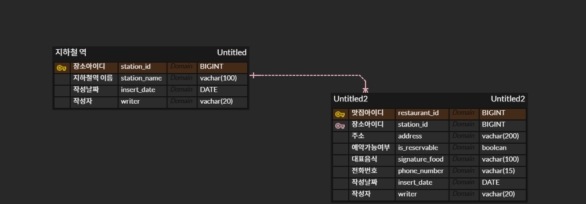

# 테이블 설계

# Rest API
1.  지하철역 주변 맛집 조회
    - URL: /food-place/{stationName}
    - Method: GET
    - Request
        - stationName: String
    - Response
        - code: String
        - message: String
        - List
          - address: String
          - isReservable: String
          - signatureFood: String
          - phoneNumber: LocalDateTime

2. 예약 가능한 맛집 조회
    - URL: /food-place/reservable
    - Method: GET
    - Request
        - stationName: String
    - Response
        - code: String
        - message: String
        - List
          - address: String
          - isReservable: String
          - signatureFood: String
          - phoneNumber: LocalDateTime
3. 대표음식으로 조회
    - URL: /food-place/signature-food
    - Method: GET
    - Request
        - stationName: String
        - signatureFood: String
    - Response
        - code: String
        - message: String
        - List
          - address: String
          - isReservable: String
          - signatureFood: String
          - phoneNumber: LocalDateTime

4. 맛집 추가
    - URL: /food-place/all
    - Method: POST
    - Request
        - stationName: String
        - address: String
        - isReservable: String
        - signatureFood: String
        - phoneNumber: LocalDateTime
    - Response
        - code: String
        - message: String
        - restaurantId: Long
5. 맛집 삭제
    - URL: /food-place/{restaurantId}
    - Method: DELETE
    - Request
        - restaurantId: Long
    - Response
        - code: String
        - message: String
        - restaurantId: Long
- 
